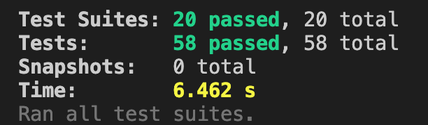

# Infinite Shooter 👾


## Library Directory 📙

| Contents                  |
| ------------------------- |
| [Built With](#built-with) |
| [Instructions](#instructions) |
| [Live Demo](#live-demo)   |
| [Install](#install)   |
| [Testing](#testing)   |
| [Authors](#authors)       |
| [License](#license)       |

## Description

> This was my final project of the JavaScript module and the aim was to create a shooter game using the framework `Phaser`


I have a built a space shooter game that you can move your character using keys and have the ability to shooter lasers. I have added a scoring system to display your score, increment every time you shoot an enemy and the option to save it to the leaderboard. I have included a main menu which you can turn the music and sound on or off as well credits and button to play.

## Instructions 🎮

### Move Character

- `UP` - `Arrow UP key`
- `DOWN` - `Arrow DOWN key`
- `LEFT` - `Arrow LEFT key`
- `RIGHT` - `Arrow RIGHT key`

### Shoot

- `Laser` - `Space bar`

## Built With 🛠

```
- JavaScript
- Phaser 3.51.0
- Jest
- Webpack
- Netlify
- VS Code
```


## Live Demo 🎥

<a href="https://infinite-shooter.netlify.app/"></a>

## Install ⏳

> Follow these steps below to get my Application working. I used [npm](https://www.npmjs.com/) to manage all my packages for JavaScript. If you don't have it installed already, you can install it [here](https://www.npmjs.com/get-npm)

1. - [ ] Open your `Terminal`
2. - [ ] Navigate to the directory where you will like to install the repo by running `cd shooter-game`
3. - [ ] Run `git clone git@github.com:DcRonan/shooter-game.git` to download <b>or</b> you can download using `HTTPS` by running `git clone https://github.com/DcRonan/shooter-game.git` in the terminal
4. - [ ] Run `cd shooter-game` to enter directory
5. - [ ] Run `npm i` to install all the packages
6. - [ ] Run `npm run build` to build the app
7. - [ ] Go on your preferred `browser` and open `dist/index.html` in the folder directory
8. - [ ] [Optional] - If you would like to edit the code for your preference then you can enter development mode by running `npm start` in the terminal


## Testing ⚙

> I have used Jest to test my code, you can find more info here: [jest](https://jestjs.io/)

1. - [ ] Open `Terminal` again
2. - [ ] Run `cd shooter-game` to enter directory
3. - [ ] Run `npm test` to start testing
4. - [ ] All tests will pass ✅



## Authors

### 👨‍💻 Daniel Ronan

[](https://github.com/DcRonan) <br>
[](https://www.linkedin.com/in/dan-ronan/) <br>
[](mailto:danielconnorronan@gmail.com) <br>
[](https://twitter.com/dc_ronan)

### Acknowledgements ⭐

Assets that I had used: [Kenney](https://kenney.nl/assets/space-shooter-redux)

### 🤝 Contributing

Contributions, issues and feature requests are welcome!

Feel free to check the [issues page](https://github.com/DcRonan/shooter-game/issues).

### Show your support

Give a ⭐️ if you like this project!

### License


